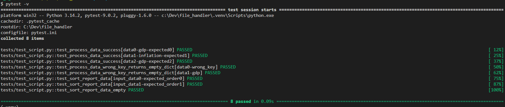

# file_handler
Маленький скрипт, который читает файлы формата cvs, фильтрует и сортирует их, выводя в консоль таблицу.
## Стек техологий
- Python 3.14+
- pytest 7.2.0
- tabilate 0.9.0

## Установка и запуск
- Развернуть скрим на локально устройстве и активироват виртуальноу окружение 
 ```Bash
git clone git@github.com:TIRAGAa/file_handler.git

python -m venv venv

source .venv/Scripts/activate

pip install -r requeriments
 ```

 - Запуск скрипта 
 ```bash
 # переходите в директорию script/
 cd script

 python main.py --file "Название файла(ов)" --report "average-(стобец)" 

#пример выврда inflation
+----+----------------+-----------+
|    | country        | inflation |
+----+----------------+-----------+
|  1 | Russia         |      9.30 |
|  2 | Brazil         |      7.40 |
|  3 | United Kingdom |      6.67 |
|  4 | Germany        |      6.00 |
|  5 | India          |      5.97 |
|  6 | Italy          |      5.67 |
|  7 | United States  |      5.37 |
|  6 | Italy          |      5.67 |
|  7 | United States  |      5.37 |
|  8 | Australia      |      4.90 |
|  9 | Canada         |      4.70 |
| 10 | France         |      4.40 |
| 11 | South Korea    |      3.73 |
| 12 | China          |      1.83 |
| 13 | Japan          |      1.83 |
+----+----------------+-----------+
 ```

 # Pytest - Запуск 
 Описание: тесты наложены на 2-е функции. (Обработка данных и сортировка)
 ```bash
pytest -v (для подробного запуска теста )
 ```
 

 
 ###### признаюсь чесно, в тестах я не cилен, но сейчас начал активно учить их. 
 ###### При написании тестов опирался на видеогайд от Артёма Шумейко 😅
 

